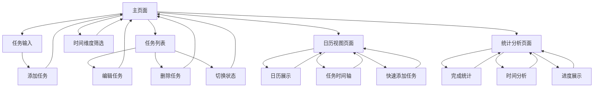

# TodoList 待办事项网站产品需求文档

## 1. 产品概述

一个功能全面的时间管理和待办事项网站，支持多时间维度的任务规划，帮助用户高效管理日常、周期和长期任务。

* 解决用户任务管理混乱、时间规划不当的问题，提供日任务、周任务、月任务的分类管理，适用于个人用户进行全方位的时间管理。

* 通过多维度的时间视图和智能的任务分类，让时间管理变得系统化和可视化，全面提升用户的工作效率和生活规划能力。

## 2. 核心功能

### 2.1 用户角色

本产品采用单用户模式，无需区分用户角色。所有功能对默认用户开放。

### 2.2 功能模块

我们的时间管理网站包含以下主要页面：

1. **主页面**：任务输入区域、任务列表展示、时间维度筛选功能
2. **日历视图页面**：日历展示、任务时间轴、快速任务添加
3. **统计分析页面**：任务完成统计、时间维度分析、进度展示

### 2.3 页面详情

| 页面名称   | 模块名称   | 功能描述                                                   |
| ------ | ------ | ------------------------------------------------------ |
| 主页面    | 任务输入区域 | 提供任务标题输入框、截止时间选择器、优先级下拉选择、时间维度选择（日/周/月）、添加按钮，支持快速创建新任务 |
| 主页面    | 任务列表展示 | 以列表形式展示所有任务，包含任务标题、创建时间、截止时间、优先级、时间维度标签，清晰区分已完成和未完成状态  |
| 主页面    | 时间维度筛选 | 提供"全部"、"今日任务"、"本周任务"、"本月任务"、"已完成"、"未完成"等筛选选项，支持多维度任务查看 |
| 主页面    | 任务状态管理 | 提供复选框支持勾选/取消勾选来标记任务完成状态，已完成任务显示删除线和灰色字体                |
| 主页面    | 任务编辑功能 | 支持点击编辑按钮修改任务标题、截止时间、优先级、时间维度等信息，提供保存和取消操作              |
| 主页面    | 任务删除功能 | 提供删除按钮移除不需要的任务，包含确认提示避免误删                              |
| 主页面    | 空状态提示  | 当没有任务时显示友好的引导信息，鼓励用户添加第一个任务                            |
| 日历视图页面 | 日历展示   | 提供月视图日历，显示每日的任务数量和重要任务，支持点击日期查看详细任务                    |
| 日历视图页面 | 任务时间轴  | 按时间顺序展示当日/当周/当月的任务安排，提供时间轴视图便于时间规划                     |
| 日历视图页面 | 快速任务添加 | 支持在日历上直接点击日期快速添加该日期的任务，提高操作效率                          |
| 统计分析页面 | 任务完成统计 | 展示日/周/月的任务完成率、完成数量等统计数据，提供图表可视化                        |
| 统计分析页面 | 时间维度分析 | 分析用户在不同时间维度的任务分布和完成情况，帮助优化时间管理                         |
| 统计分析页面 | 进度展示   | 显示当前周期内的任务进度，包括进度条、百分比等直观展示方式                          |
| 全局功能   | 数据持久化  | 使用localStorage实现本地存储，确保页面刷新后任务数据不丢失，支持数据导入导出           |

## 3. 核心流程

用户操作流程：

1. 用户访问主页面，查看当前任务列表和时间维度筛选选项
2. 用户在输入区域填写任务信息（标题、截止时间、优先级、时间维度）并点击添加按钮创建新任务
3. 用户可以通过时间维度筛选查看不同类型的任务（全部/今日/本周/本月/已完成/未完成）
4. 用户点击任务前的复选框标记任务完成状态
5. 用户点击编辑按钮修改任务信息，或点击删除按钮移除任务
6. 用户可以切换到日历视图页面，查看日历形式的任务安排和时间轴
7. 用户可以在日历上直接点击日期快速添加任务
8. 用户可以访问统计分析页面，查看任务完成情况和时间管理分析
9. 所有操作立即生效并保存到本地存储

## 4. 用户界面设计

### 4.1 设计风格

* **主色调**：#4A90E2（蓝色）作为主色，#F5F5F5（浅灰）作为背景色

* **辅助色**：#28A745（绿色）表示完成状态，#DC3545（红色）表示删除操作，#FFC107（黄色）表示高优先级，#17A2B8（青色）表示日任务，#6F42C1（紫色）表示周任务，#E83E8C（粉色）表示月任务

* **按钮样式**：圆角矩形按钮，悬停时有阴影效果，支持多状态切换

* **字体**：主要使用系统默认字体，标题16px，正文14px，小字12px

* **布局风格**：卡片式布局，顶部导航栏包含页面切换，内容居中对齐，支持多页面布局

* **图标风格**：使用简洁的线性图标，支持添加、编辑、删除、完成、日历、统计等操作图标

### 4.2 页面设计概览

| 页面名称   | 模块名称   | UI元素                                                            |
| ------ | ------ | --------------------------------------------------------------- |
| 主页面    | 顶部导航   | 水平导航栏，包含"任务列表"、"日历视图"、"统计分析"三个标签页，选中状态显示蓝色下划线                   |
| 主页面    | 任务输入区域 | 白色卡片容器，包含文本输入框、日期选择器、优先级下拉菜单、时间维度选择器（日/周/月）、蓝色添加按钮，采用响应式flex布局  |
| 主页面    | 任务列表展示 | 每个任务项为白色卡片，包含复选框、任务标题、时间标签、优先级标识、时间维度彩色标签、操作按钮组，已完成任务显示灰色背景和删除线 |
| 主页面    | 时间维度筛选 | 水平排列的筛选按钮组，包含"全部"、"今日"、"本周"、"本月"、"已完成"、"未完成"，选中状态显示对应颜色背景       |
| 主页面    | 空状态提示  | 居中显示的插图和提示文字，使用浅灰色调，包含引导性的添加按钮                                  |
| 日历视图页面 | 月历展示   | 标准月历布局，每个日期格子显示任务数量小圆点，重要任务显示彩色标记，支持点击交互                        |
| 日历视图页面 | 任务时间轴  | 垂直时间轴布局，按时间顺序展示任务，使用不同颜色区分时间维度，支持拖拽调整                           |
| 日历视图页面 | 快速添加   | 浮动添加按钮，点击日期后弹出快速添加表单，预填选中日期信息                                   |
| 统计分析页面 | 统计图表   | 使用饼图、柱状图、折线图展示任务完成情况，采用响应式图表设计，支持数据筛选                           |
| 统计分析页面 | 进度展示   | 圆形进度条显示当前周期完成率，配合数字和百分比文字说明                                     |
| 统计分析页面 | 数据卡片   | 网格布局的数据卡片，展示关键指标如总任务数、完成率、平均完成时间等                               |

### 4.3 响应式设计

采用移动端优先的响应式设计策略，支持触摸交互优化。

* **移动端（<768px）**：单列布局，按钮增大便于触摸操作

* **平板端（768px-1024px）**：适当调整间距和字体大小

* **桌面端（>1024px）**：最大宽度限制，内容居中显示，支持鼠标悬停效果

